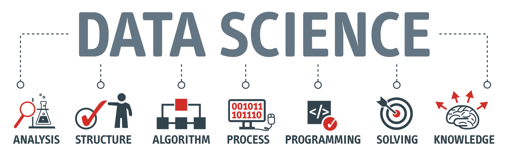

# Roadmap Data Scientist

The basic roadmap to become a data scientist

## Courses

### Python

- [Python for Data Science](https://courses.cognitiveclass.ai/courses/course-v1:Cognitiveclass+PY0101EN+v2/info)
- [Data Visualization with Python](https://courses.cognitiveclass.ai/courses/course-v1:CognitiveClass+DV0101EN+v1/info)
- [Data Analysis with Python](https://courses.cognitiveclass.ai/courses/course-v1:CognitiveClass+DA0101EN+2017/info)

### Machine Learning

- [Machine Learning with Python](https://courses.cognitiveclass.ai/courses/course-v1:CognitiveClass+ML0101ENv3+2018/info)
-
-

### Data Science

- [Introduction to Data Science](https://courses.cognitiveclass.ai/courses/course-v1:BigDataUniversity+DS0101EN+2016/info)
- [Data Science Methodology](https://courses.cognitiveclass.ai/courses/course-v1:CognitiveClass+DS0103EN+v3/info)
- [Data Science Hands-On with Open Source Tools](https://courses.cognitiveclass.ai/courses/course-v1:CognitiveClass+DS0105EN+v2/info)

### SQL

-
-
-

### Deploy ML models

-
-
-

## Tutorials

## Resources
